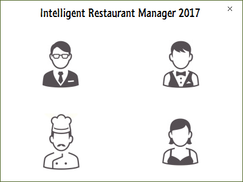
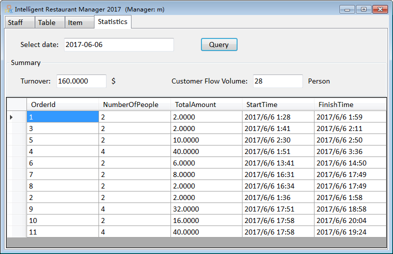
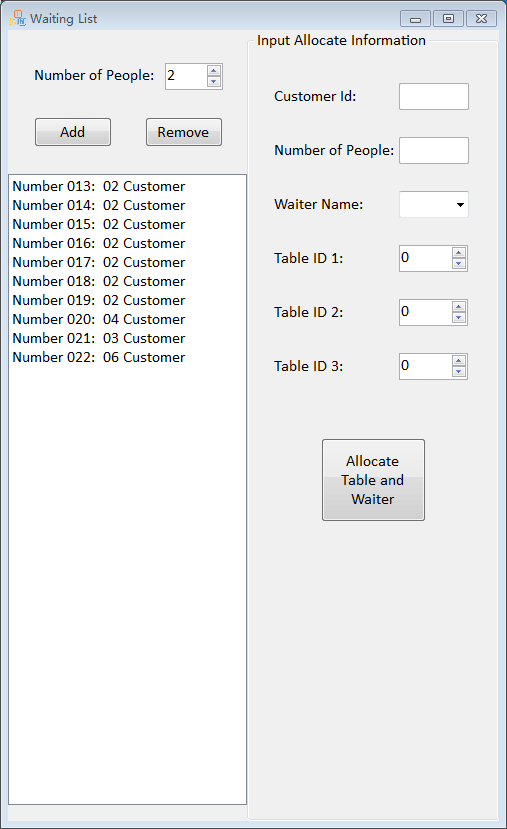
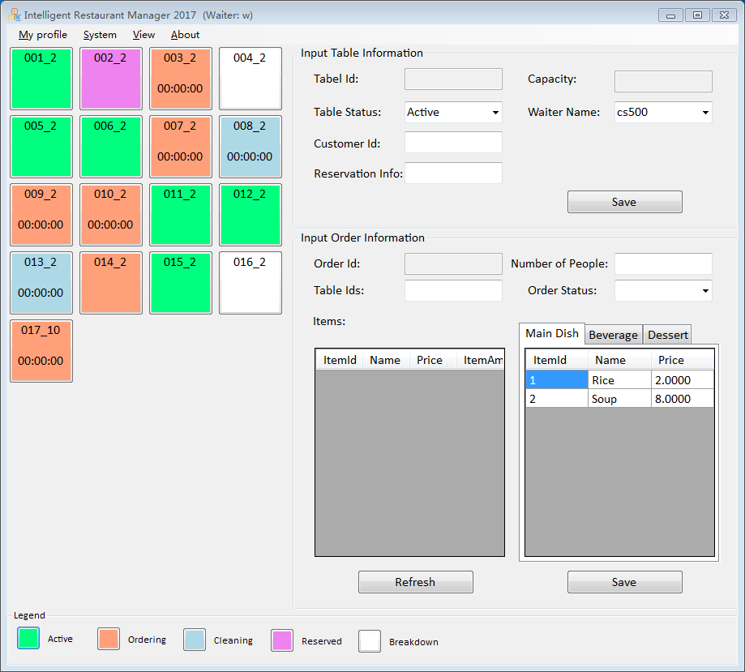

# Intelligent Restaurant Manager
Intelligent Restaurant Manager is a generalized large restaurant table management program.
It optimizes seat placement during busy hours and offloads work from managing personnel.

## System Overview
The system provides four seperate modules for the manager, waiter, cook, and guest.

*  Login
    

*  Manager module

    

*  Waiter module
    * Manage waiting list and assign seats automatically 
    
      
      
    * Manage orders and table status
    
      
